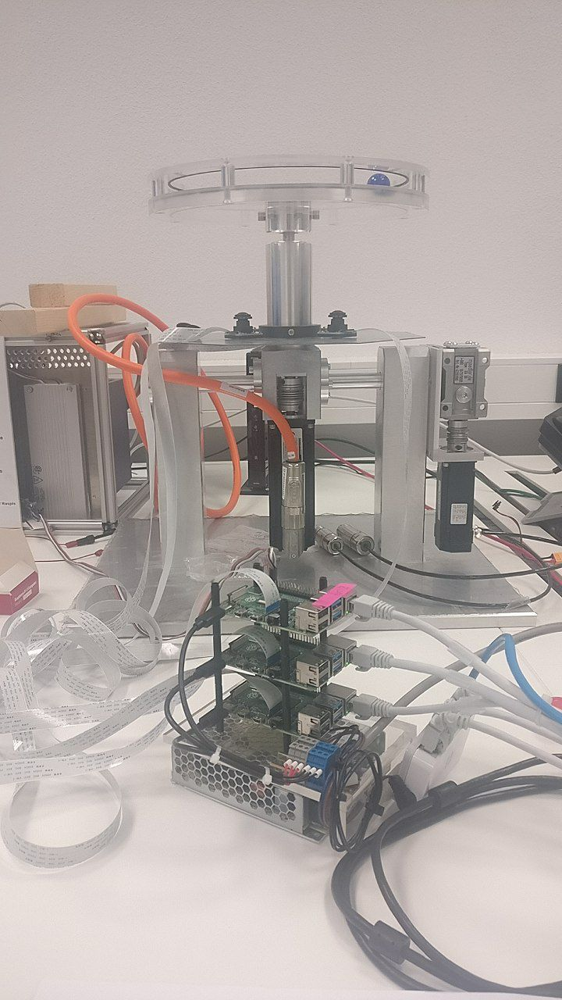
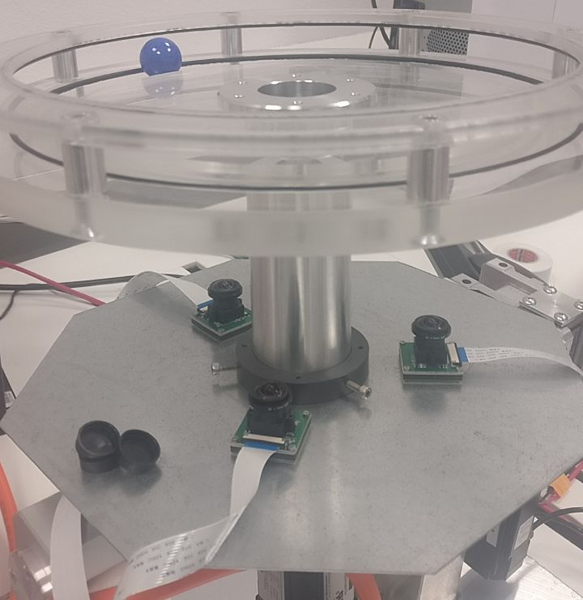
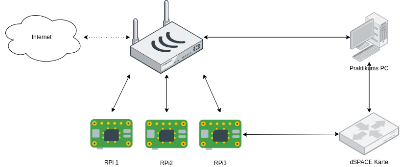

=====
Setup
=====

Hardware Setup
==============

Hoop
----

The construction of the hoop and the electrics are out of scope for this documentation.

Raspberry Pis
-------------

For the project 3 Raspberry PIs Model 4 with 4 GB RAM have been used.
8 GB Flash drive probably would have been sufficient, a bit more will not hurt.
Each with one Raspberry Pi Cameras Model v1.
The Cameras are arranged evently on the circle like here

Network
-------
A normal router has been used, where all RPis (+ your local development machine) are connected.
The router should have internet access during development and deployment, but not afterwards.
If you keep the internet make sure the access to the raspberry pis is secured accordingly.

One of the pis has to be connected with the serial gpio pins to the dspace card.

The pc acts as a command and control entity in the setup,
which announces what the pis should do and manages the dspace programming.

Software
========

Install Operating System
------------------------

Install on every Raspberry Pi SD Card, which shall be used, Raspian OS.
Details for installation can be found on their `webiste <https://www.raspberrypi.com/software/>`_.

Install via raspi-imager
************************

Pick OS -> Other -> Raspberry Pi OS lite (no Desktop) or just pick the recommended (with Desktop)
Press Strg+Shift+X for Advanced Options (or press the gear):

- Hostname: rpi[1-3].local (pick one of the numbers)
- Activate SSH and pick one of your SSH-Keys if wanted (recommended instead of password auth)
- Set username and password if wanted (you have to fixup these in ansible!)
- Pick timezone and keyboard layout to your liking

Pick your SD card and write the image!

Manuel set
**********

Make sure the ssh server is enabled, and you know the password or can login via `ssh-key <https://www.digitalocean.com/community/tutorials/how-to-configure-ssh-key-based-authentication-on-a-linux-server-de>`_.
The SSH-Server will be activated at boot if there is a (empty) file with the name `ssh` on the boot partition.
Via commandline this can be done with:

.. code-block:: sh

   touch ssh

in the boot partition.

Also make sure the used password on the PIs is not the default, especially if they are exposed in the (local) network later and an activated SSH-Server.
And make sure your public key is copied to the raspberry pi. This can be done with the following command.

.. code-block:: sh

   ssh-copy-id pi@<your-ip-adress-or-hostname-here>

The default password of the pi is `rapsberry`. Please change it with the `passwd` command

Deploy via Ansible
------------------

Make sure you have ansible installed on your local machine, and the RPis are in the same Network, and you know their IP address.
Enter the hostnames in `setup/hosts.yml` and use the following command to install it on all hosts

.. code-block:: sh

   ansible-playbook setup/setupRPi.yml -i setup/hosts.yml

or instead one of the following single hosts

.. code-block:: sh

   ansible-playbook setup/setupRPi.yml -i rpi1
   ansible-playbook setup/setupRPi.yml -i <your-ip-here>

Deploy via manual installation
------------------------------

(if you used ansible you can skip this section)

Install this repo and python
****************************

Install the following packages via the system packet manager on the RPis:

.. code-block:: sh

   sudo apt install git python3 python3-opencv python3-picamera

clone this git repo locally

.. code-block:: sh

   git clone https://github.com/lukas-staab/ball-and-hoop.git

install the pip requirements (you need only one of the commands)

.. code-block::

   python3 -m pip install -r requirements.txt
   pip3 install -r requirements.txt

Configure Interfaces
***********************

activate the legacy camera and the serial com in

.. code-block:: sh

   sudo raspi-config

