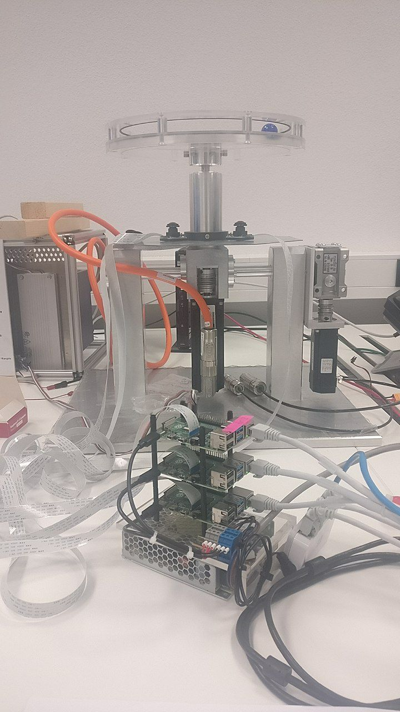
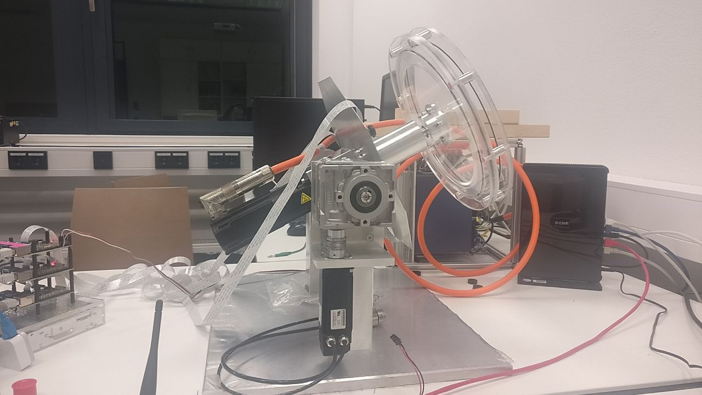
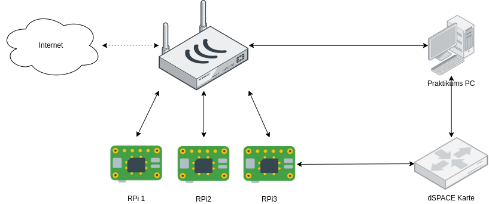

Introduction
------------

This repository has the code for a distributed camera-sensor which messures the angle of the ball in the hoop

There are 3 cameras evenly distributed on the circle plate.
The hoop can spin in 2 axes.

Scope
*****

This repository has only the python code for the camera sensors. It sends its result to a dspace card,
which is connected to one of the pi's through a serial connection. The 3 pis can communicate through a ethernet connection

Using this software
*******************

:doc:`Installation guide<setup>`
    How to deploy the software.

:doc:`Running and calibrating<usage>`
    How to calibrate and run the software.

:doc:`Code<code/index>`
    Documentation of the software.

.. toctree::
   :caption: Documentation
   :maxdepth: 2
   :hidden:

   Installation<setup>
   Usage<usage>
   Configuration<config>

.. toctree::
   :caption: Development
   :maxdepth: 2
   :hidden:

   Local development<debugging>
   Full code API<code/index>